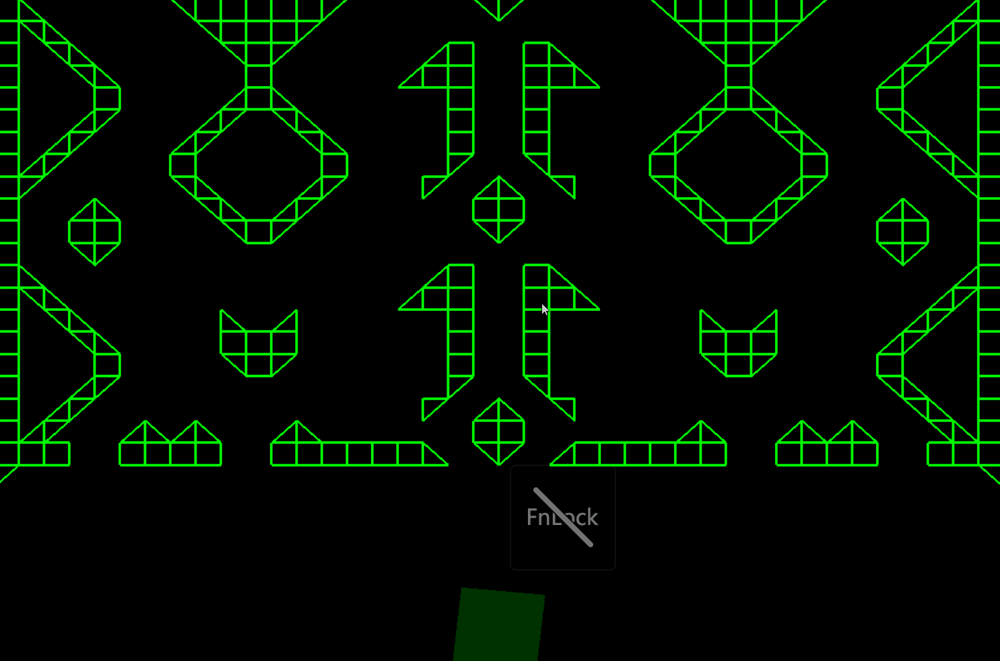

# PinBall Game
This is a PinBall game/simulation that i made for an assignment while studying CMGT at saxion.
This game was made using the Saxion GXPEngine.

## Some footage of the game

It is a really simple simulation centered around rotation and collision of line segments
